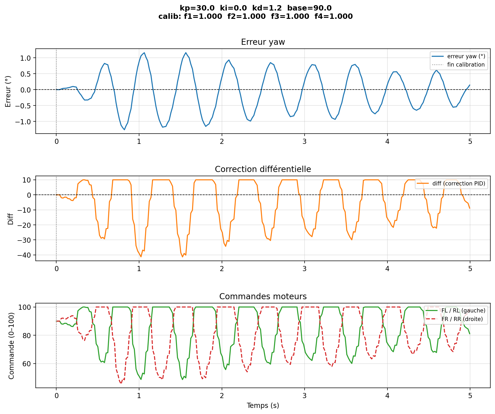

# Rosmaster PID Controller Project

## Overview
This repository contains a rich implementation of a Proportional-Integral-Derivative (PID) controller for a Rosmaster robot. The goal of this project is to create an automated, real-time control system that corrects the robot's heading (Yaw) and provides detailed data visualization of its performance. By tuning Kp, Ki, and Kd gains, the robot learns to stabilize its movements precisely over time to follow a straight path or handle turning maneuvers.

## Features
- **Real-Time PID Control**: Stabilizes Rosmaster Yaw drift dynamically.
- **IMU Sensor Integration**: Extracts Yaw data to compute accurate error signals relative to a setpoint.
- **Live Differential Drive Command Pipeline**: Commands motor speeds based on PID output to compensate for offset.
- **In-Depth Output Logging**: Records variables like time, yaw, error, PID output, and instantaneous motor speeds in CSV format.
- **Data Visualization & Analytics**: Automatically plots CSV metrics to PNG graphs (`matplotlib`), allowing direct visualization of stability, overshoot, and latency. 
- **Bulk Diagnostic Script**: Use `plot_pid_analysis.py` to recursively evaluate multiple CSV runs, find lowest Root Mean Squared Errors (RMSE), and generate combined comparison plots.

---

## File Structure

- `pid_controller.py`: The robust control application. Manages initialization of the Rosmaster library, resets IMU offsets, calculates PID adjustments, parses arguments, runs the main event loop, and finally records and plots the session data.
- `plot_pid_analysis.py`: Given multiple `.csv` dumps in the structure, this script determines the best parameters configuration using error magnitude mapping. 
- `py_install/`: Contains the dependent Rosmaster underlying logic (`Rosmaster_Lib`) and its virtual environment.
- `data/`: Contains runtime outputs (`.csv` files and generated `.png` graphs) corresponding to experimental tests.
- `video/`: Visual proof and active demonstrative footage of the controller interacting with dynamic real-world physics.

---

## Getting Started

### Prerequisites
You need a system configured with Python 3 and the `Rosmaster_Lib` interface working.
```bash
# Source your virtual environment
source py_install/.venv/bin/activate
# Make sure matplotlib is installed
pip install matplotlib
```

### Running the Controller

Execute the base controller providing the desirable PID coefficients (for example Kp=30, Ki=0, Kd=1.2).
```bash
python3 pid_controller.py --base 90 --duration 6 --kp 30 --ki 0 --kd 1.2
```
Arguments:
- `--base`: Base PWM speed given to the motors.
- `--duration`: Logging time constraint in seconds.
- `--kp`, `--ki`, `--kd`: Gain constants respectively for proportional, integral, and derivative corrections.
- `--setpoint`: The goal target angle in degrees for the Yaw (default is 0.0).

The script stops autonomously and saves `{run...}.csv` along with a synthesized `.png` dashboard.

### Analysing Controller Efficiency

When possessing an array of runs on varied parameters, utilize the analytical plotter:
```bash
python3 plot_pid_analysis.py --show --pid-only
```

---

## Experimental Results and Visualization

Through iterations, inserting a tuned Derivative term profoundly stabilized oscillation observed under pure proportional adjustments. Optimal stable navigation occurred mapping `Kp = 30.0` and `Kd = 1.2` for a base trajectory speed factor of 90. 

### Data Graphs Example
Below is an example of the control outputs mapped against Yaw recovery:


### Live Video Demonstrations

*Observe the control correction visually natively within the test rig.*

#### PID Implementation Video 1
<video src="video/MicrosoftTeams-video2.mp4" controls="controls" style="max-width: 100%;">
  Your browser does not support the video tag.
</video>

#### PID Implementation Video 2
<video src="video/MicrosoftTeams-video.mp4" controls="controls" style="max-width: 100%;">
  Your browser does not support the video tag.
</video>

> *Note: Viewing local `.mp4` markdown video inclusions depends on the rendering engine (e.g., GitHub, VS Code).*

---

## Summary of the Control Algorithm

The applied algorithm reads incoming orientation from IMU.
1. Computes delta (Error) mapping present rotation versus 0.0 standard.
2. Derives rotational corrections considering historical error delta (Kd).
3. Adapts left-wheel and right-wheel motor commands accordingly relative to `base_speed`.
4. Saves session telemetry, providing seamless iterative development.
